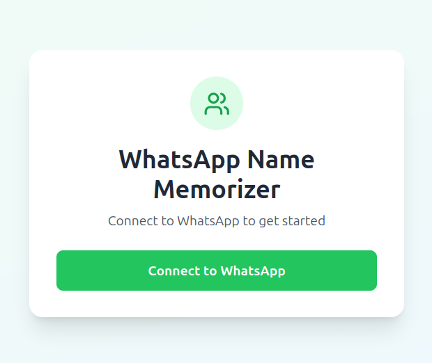
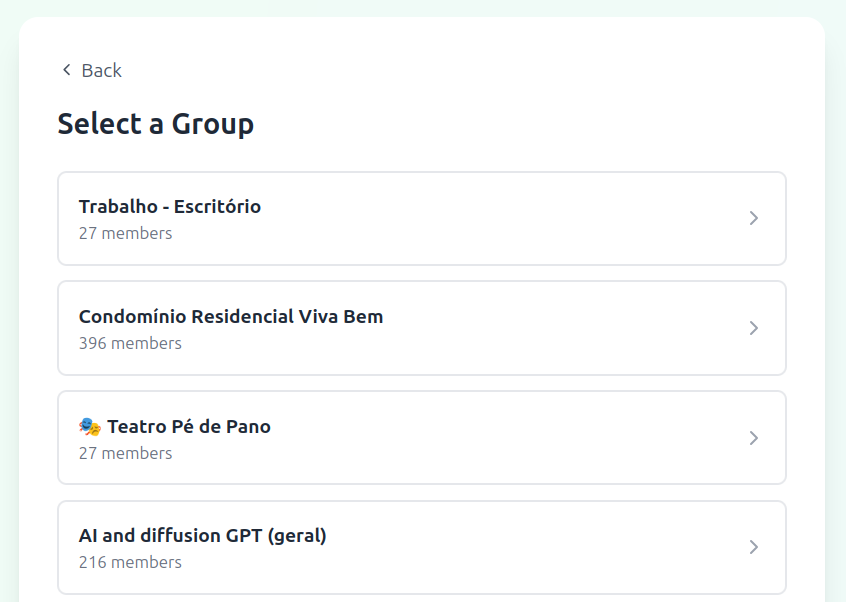

# WhatsApp Memorizer

A web application that helps you memorize names from your WhatsApp groups by connecting to WhatsApp Web and providing an interactive learning interface.



## 🚀 Quick Setup

### Prerequisites
- Node.js (v14 or higher)
- npm
- A WhatsApp account

### Backend Setup
1. Navigate to the backend directory:
   ```bash
   cd backend
   ```

2. Install dependencies:
   ```bash
   npm install
   ```

3. Start the backend server:
   ```bash
   npm start
   ```
   
   The backend will run on **port 3001**

### Frontend Setup
1. Navigate to the frontend directory:
   ```bash
   cd frontend
   ```

2. Install dependencies:
   ```bash
   npm install
   ```

3. Start the frontend development server:
   ```bash
   npm start
   ```
   
   The frontend will run on **port 3000**

## 📱 How to Use

### Step 1: Launch the Application
1. Make sure both backend (port 3001) and frontend (port 3000) are running
2. Open your browser and go to `http://localhost:3000`

### Step 2: Connect to WhatsApp
1. Click on the "Connect to WhatsApp" button
2. The application will display a QR code
3. Open WhatsApp on your phone
4. Go to **Settings** > **Linked Devices** > **Link a Device**
5. Scan the QR code displayed in the web application

### Step 3: Select a Group
1. Once connected, you'll see a list of your WhatsApp groups
2. Click on the group you want to practice with
3. The application will load the participants from that group



### Step 4: Start Memorizing
1. The app will show you profile pictures from the selected group
2. Try to guess the name of the person
3. Click to reveal the correct answer
4. Track your progress as you learn everyone's names


## 🛠️ Development

### Tech Stack
- **Backend**: Node.js, Express
- **Frontend**: React
- **WhatsApp Integration**: WhatsApp Web API

## 📝 Notes
- The application uses WhatsApp Web's interface to access your groups
- Make sure to keep both backend and frontend running simultaneously

## 🤝 Contributing
Feel free to submit issues and enhancement requests!
